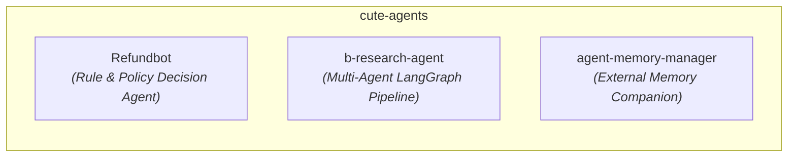

# Cute Agents -- Monorepo Agent Directory

This repository hosts a curated collection of specialized autonomous AI agents implementing different foundational architectural patterns and system paradigms.

---

## Agents & Architectural Paradigms

| Agent Kit | Directory | Paradigm | Core Stack | Status |
|---|---|---|---|---|
| **Refundbot** | [`/Refundbot`](./Refundbot) | Policy-governed tool calling & transaction guardrails | Python, FastAPI, SQLite/Postgres | Production Ready |
| **Research Assistant** | [`/b-research-agent`](./b-research-agent) | Multi-agent DAG (Planner -> Research -> Writer -> Critic -> Persist) | LangGraph, FastAPI, Qdrant, React | Production Ready |
| **Agent Memory Manager** | [`/agent-memory-manager`](./agent-memory-manager) | Episodic memory sidecar & failure tracking companion | Python, Event-driven Memory Sidecar | Active Development |

---

## Agent Engineering Standards

Every agent in this repository conforms to the following standards:
1. **Isolated Environments**: Standalone dependencies (`requirements.txt`, `pyproject.toml`, or `package.json`) allowing independent building, testing, and deployment.
2. **Standardized Documentation**:
   - `README.md`: Human-facing documentation and installation guide.
   - `AGENTS.md`: Agent architecture specification, tool interface definition, and operational contracts.
3. **Observability & Evaluation**: Integrated logging, trace collection, and evaluation metrics (e.g. Ragas, unit/integration suites).
