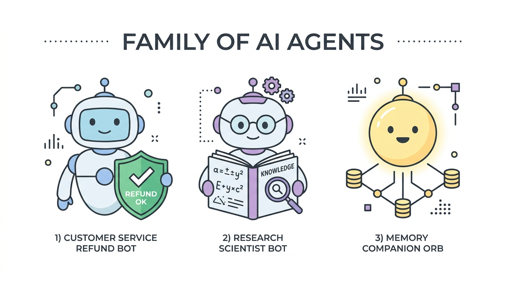

# cute-agents
### Collection of AI system paradigms

<p align="center">
  
</p>

---

A curated monorepo featuring specialized AI agent architectures, multi-agent workflows, and memory companions demonstrating foundational AI system paradigms.

---

## 🤖 Agent Kits & Paradigms

| Agent Kit | Architectural Paradigm | Key Technologies | Description |
|---|---|---|---|
| 🛡️ **[Refundbot](./Refundbot)** | **Deterministic Guardrail & Tool-Calling Agent** | Python, FastAPI, SQLite / PostgreSQL | Customer service and refund decision engine with policy evaluation, fraud scoring, and audit trails. |
| 🔬 **[Research Assistant (`b-research-agent`)](./b-research-agent)** | **Multi-Agent Directed Graph (DAG)** | LangGraph, FastAPI, Qdrant Vector DB, React 18 | Multi-agent autonomous research assistant: **Planner → Research → Writer → Critic → Persist** with fact-checking loops and evaluation dashboard. |
| 🧠 **[Agent Memory Manager](./agent-memory-manager)** | **External Memory Companion & Sidecar** | Python, Event-driven Memory Sidecar | Dedicated companion agent tracking environment errors and providing targeted memory reminders to improve long-horizon task completion. |

---

## 📂 Monorepo Structure

```
my-cute-agents/
├── assets/
│   └── banner.jpg               # Diagrammatic family of AI agents illustration
├── 🤖 Refundbot/                # Policy & customer support agent
│   ├── AGENTS.md                # Agent specification & tool contracts
│   └── readme.md
├── 🔬 b-research-agent/          # Multi-agent LangGraph research engine
│   ├── AGENTS.md                # Multi-agent graph specification
│   ├── api/                     # FastAPI backend & LangGraph runner
│   ├── ui/                      # React + Vite frontend
│   └── readme.md
├── 🧠 agent-memory-manager/     # Memory companion & state tracker
│   ├── AGENTS.md                # Memory companion specification
│   └── readme.md
├── AGENTS.md                    # Monorepo agent directory & standards
└── README.md                    # Main overview & deployment guide
```

---

## 🚀 Independent Deployment Guide

Each agent is decoupled and can be deployed individually from this monorepo:

### 1. Render / Railway / Fly.io / Vercel
Set the **Root Directory** (or **Base Directory**) in your service settings:
* **Refundbot API**: `Refundbot`
* **Research Assistant Backend**: `b-research-agent`
* **Research Assistant UI**: `b-research-agent/ui`

### 2. Docker Containers
Build images directly targeting each agent directory:
```bash
# Build Refundbot
docker build -t cute-agents/refundbot ./Refundbot

# Build Research Agent API
docker build -t cute-agents/research-agent ./b-research-agent
```

### 3. GitHub Actions CI/CD
Use path triggers in workflows so deployments only fire when a specific agent's code changes:
```yaml
name: Deploy Refundbot
on:
  push:
    paths:
      - 'Refundbot/**'
jobs:
  deploy:
    runs-on: ubuntu-latest
    steps:
      - uses: actions/checkout@v4
      - run: echo "Deploying Refundbot..."
```

---

## 📜 License
MIT
