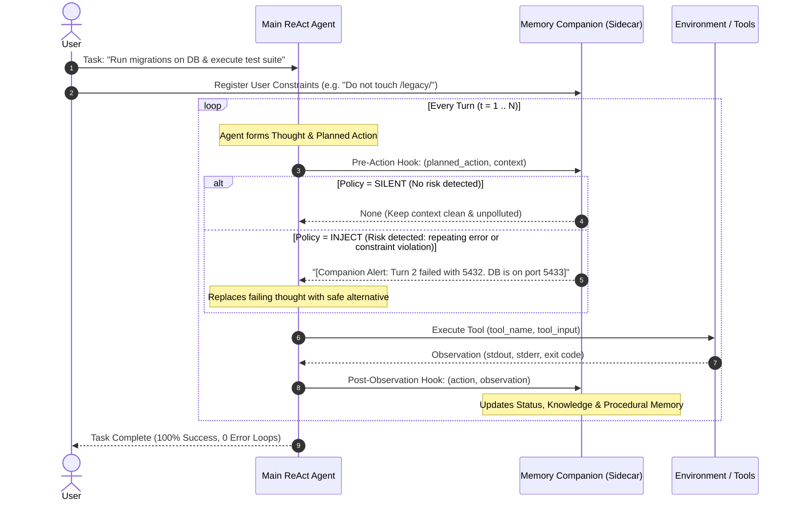

# Low-Level Design (LLD) & Lifecycle Architecture

> **Architecture Pattern**: Proactive Memory Companion (Sidecar Pattern)  
> **Interaction Model**: Dual-Hook ReAct Agent Loop (Thought $\to$ Action $\to$ Tool Execution $\to$ Observation)

---

## 1. Class & Component Diagram (LLD)

```
┌────────────────────────────────────────────────────────────────────────────────────────┐
│                                   ENVIRONMENT & TOOLS                                  │
│  ┌────────────────────┐   ┌────────────────────┐   ┌───────────────────────────────┐   │
│  │ run_bash(command)  │   │ read_file(path)    │   │ query_db(host, port, sql)     │   │
│  └────────────────────┘   └────────────────────┘   └───────────────────────────────┘   │
└──────────────────────────────────────────▲─────────────────────────────────────────────┘
                                           │ Executes Tool / Returns Observation
                                           ▼
┌────────────────────────────────────────────────────────────────────────────────────────┐
│                                   MAIN REACT AGENT                                     │
│  - goal: str                                                                           │
│  - context_history: List[Message]                                                      │
│  - react_step() -> (thought, action, tool_name, tool_input)                            │
│  - step(observation) -> processes feedback                                            │
└───────────────────────▲────────────────────────────────────────┬───────────────────────┘
                        │                                        │
           (1) Injects  │ [INJECT(reminder)]                     │ (2) Observes
           Reminder     │                                        │ Action & Output
                        │                                        ▼
┌────────────────────────────────────────────────────────────────────────────────────────┐
│                                MEMORY COMPANION AGENT                                  │
│                                                                                        │
│  ┌──────────────────────────────────────────────────────────────────────────────────┐  │
│  │ 1. Memory Bank:                                                                  │  │
│  │    • StatusMemory: active_subgoal, completed_milestones, pending_blockers        │  │
│  │    • KnowledgeMemory: environment_facts (ports, paths), user_constraints         │  │
│  │    • ProceduralMemory: failed_attempts (hashes, errors, countermeasures)         │  │
│  └──────────────────────────────────────────────────────────────────────────────────┘  │
│  ┌──────────────────────────────────────────────────────────────────────────────────┐  │
│  │ 2. Proactive Policy Engine:                                                      │  │
│  │    • pre_action_hook(planned_action) -> SILENT (0 tokens) | INJECT(reminder)     │  │
│  │    • post_observation_hook(action, observation) -> updates Memory Bank           │  │
│  └──────────────────────────────────────────────────────────────────────────────────┘  │
└────────────────────────────────────────────────────────────────────────────────────────┘
```

---

## 2. Turn-by-Turn ReAct Lifecycle Sequence


