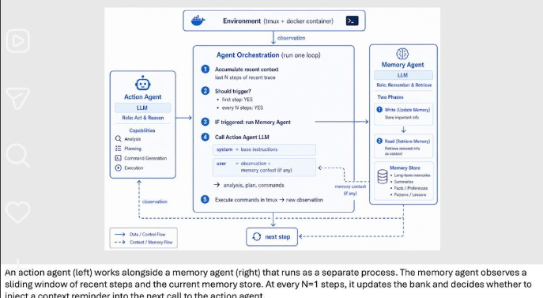

# Agent Memory Manager

> **A High-Performance External Memory Companion & Sidecar for Autonomous AI Agents**  
> *Inspired by Meta AI Research on Long-Context Task Execution & Targeted Memory Injections*

---



---

## Executive Summary

Complex, long-horizon tasks (such as software engineering, repository refactoring, terminal operations, and tool orchestration) frequently cause autonomous AI agents to suffer from **context degradation**, **repetitive failure loops**, and **state amnesia**.

**Agent Memory Manager** functions as a dedicated external memory companion (sidecar pattern). Instead of flooding the main agent's context window with full conversational histories or static knowledge dumps, it passively monitors agent execution, fingerprints tool/command failures, and injects **succinct, just-in-time nudges** only when risk triggers occur.

---

## Research Foundation & Benchmarks

* **Research Origin**: Meta AI research on autonomous agent memory companions. Full breakdown in [Research Paper Notes](file:///c:/Desktop/new-workspace/my-cute-agents/agent-memory-manager/docs/research_paper_notes.md).
* **arXiv Paper**: *Remember When It Matters: Proactive Memory Agent for Long-Horizon Agents* ([arXiv:2607.08716](https://arxiv.org/abs/2607.08716)).
* **Benchmark**: Evaluated on **$\tau^2$-Bench** (tau2-bench) and **Terminal-Bench 2.0** for long-horizon multi-step tasks.
* **Empirical Results**:
  * Boosted task success rates from **55.0%** to **61.8%** on frontier models (Claude 3.5 / 4.5 Sonnet).
  * **Critical Finding**: Continuous memory broadcasting actively degrades model performance due to attention dilution. In contrast, **targeted, episodic memory injection** preserves agent attention while eliminating command failure loops.

---

## The Core Problems It Solves

```
[Without Memory Manager (Standard Agent Loop)]
Step 3: Runs `curl -s -X POST /api/v1/auth` -> Error: 401 Unauthorized
Step 7: Context expands, agent loses track of specific error details...
Step 11: Runs exact same broken `curl` command -> Enters Failure Loop (Wasted Tokens & Stalled Execution)

[With Agent Memory Manager (Sidecar Pattern)]
Step 3: Sidecar records error signature & failure pattern silently.
Step 11: Agent prepares to retry the failed endpoint.
Sidecar Intercepts & Injects: "[Companion Warning] Turn 3 failed with 401: Bearer token is expired. Use /api/v1/refresh first."
```

| Failure Mode | Standard Autonomous Agent | With Agent Memory Manager |
| :--- | :--- | :--- |
| **Command Failure Loops** | Repeats bad commands across turns when context grows | Fingerprints errors & intercepts repetitive failures |
| **Context Window Pollution** | Floods prompt with hundreds of turns of raw output | Stores history in external sidecar, keeping context lean |
| **Attention Degradation** | Broadcasts huge memory blocks every turn, diluting focus | Injects short, high-priority notes only when triggered |
| **State Drift** | Loses active variables, active directories, and sub-goals | Tracks live working memory & environmental state |

---

## Key Capabilities

1. **Failure Fingerprinting & Loop Breaker**:
   * Hashes tool calls and maps them to structured error outputs.
   * Intercepts repetitive bad commands before the agent wastes tokens or stalls.
2. **Attention-Aware Dynamic Injection**:
   * Configurable injection rules: only injects when similarity heuristics match failure risks or sub-goal transitions.
3. **Working Memory & State Snapshots**:
   * Maintains active working memory (scratchpad, environment variables, modified files, sub-goal checklist) across multi-turn sessions.
4. **Pluggable Architecture**:
   * **Python Middleware / SDK**: Simple decorator/wrapper (`@companion.watch`) for LangChain, LangGraph, LiteLLM, or custom LLM loops.
   * **MCP Server**: FastMCP server integration for Claude Desktop, Cursor, and Antigravity IDEs.
5. **Real-Time Telemetry & Visual Dashboard**:
   * Live dashboard showing memory state, intercepted loops, token savings, and injection timelines.

---

## Project Architecture

```
agent-memory-manager/
├── companion/                 # Core Memory Engine
│   ├── __init__.py
│   ├── tracker.py             # Error signature & tool call fingerprinting
│   ├── working_memory.py      # Active state, variables & goal scratchpad
│   ├── injection_policy.py    # Decider: when to inject vs suppress (attention budget)
│   ├── store.py               # Local SQLite + hybrid retrieval
│   └── middleware.py          # Drop-in hooks for LangChain / LiteLLM / Raw APIs
├── server/                    # MCP (Model Context Protocol) & REST API
│   ├── mcp_server.py          # Expose memory tools to Cursor / Claude / Antigravity
│   └── api.py                 # FastAPI backend for real-time monitoring
├── web/                       # Modern Glassmorphic Web Dashboard
│   ├── src/                   # Live agent visualizer & memory telemetry
│   └── ...                    # Token savings & loop prevention analytics
├── benchmarks/                # Evaluation & Test Harness
│   ├── loop_simulation.py     # Simulated multi-step agent failure test
│   └── run_benchmark.py       # Compare Vanilla Agent vs Agent + Memory Companion
├── tests/                     # Unit & Integration Tests
│   ├── test_tracker.py
│   ├── test_injection.py
│   └── test_working_memory.py
├── image.png                  # Research reference diagram
├── AGENTS.md                  # Agent architecture specification
├── pyproject.toml / requirements.txt
└── readme.md                  # Project documentation
```

---

## Implementation Roadmap

- [ ] **Phase 1: Core Engine (`companion/`)**
  - [ ] Error tracker & failure signature hashing (`tracker.py`)
  - [ ] Working memory & environmental state snapshotting (`working_memory.py`)
  - [ ] Targeted injection decider & threshold heuristics (`injection_policy.py`)
  - [ ] SQLite + hybrid keyword/vector memory store (`store.py`)
  - [ ] Universal Python Middleware / Decorator (`middleware.py`)
- [ ] **Phase 2: MCP & Server Layer (`server/`)**
  - [ ] FastMCP Server exposing `record_action`, `query_memory`, `check_failure_risk`, and `snapshot_state`
  - [ ] FastAPI streaming backend for live telemetry
- [ ] **Phase 3: Benchmark & Evaluation Suite (`benchmarks/`)**
  - [ ] Simulated agent failure-loop harness
  - [ ] Benchmark comparison report: Vanilla vs. Memory Companion (token cost, loop count, task completion rate)
- [ ] **Phase 4: Live Telemetry Web Dashboard (`web/`)**
  - [ ] Modern dashboard displaying real-time agent context, injected nudges, and savings analytics
