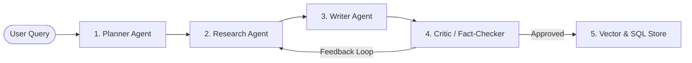

# 🔬 Agent Specification: Research Assistant (`b-research-agent`)

## 🎯 Role & Objective
An autonomous multi-agent research pipeline designed to take high-level research questions, formulate search strategies, gather and verify information from multiple web sources, synthesize comprehensive answers, and perform iterative self-criticism.

---

## 🧩 Architectural Paradigm: Multi-Agent Directed Graph (LangGraph)



### Agent Roles in the Graph:
1. **Planner Agent**: Deconstructs complex research queries into actionable search sub-queries and hypotheses.
2. **Researcher Agent**: Executes multi-hop web searches, scrapes relevant articles, and extracts source citations.
3. **Writer Agent**: Synthesizes verified findings into structured, academic-grade markdown reports.
4. **Critic Agent**: Validates claims against source citations, checks for hallucinations, and triggers re-research loops if confidence is low.
5. **Persist Agent**: Indexes final answers into PostgreSQL and embeddings into Qdrant for semantic search and future retrieval.

---

## 🛠️ Technology Stack
* **Orchestration**: LangGraph, LangChain
* **API & Backend**: FastAPI, Pydantic v2
* **Storage**: Qdrant Vector Store, PostgreSQL, SQLAlchemy
* **Frontend**: React 18, Vite, TypeScript, Tailwind CSS
* **Evaluation**: Ragas + Agentic Eval framework

---

## 🚀 Execution
```bash
# Start backend
uv run uvicorn api.main:app --reload --port 8000

# Start UI
cd ui && npm run dev
```
