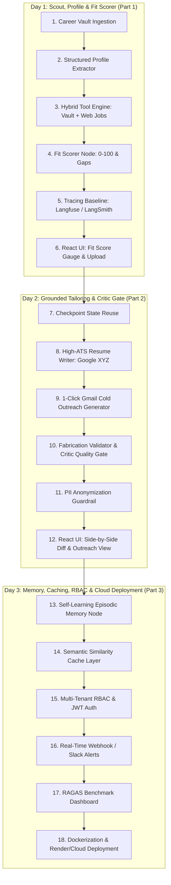

# 🚀 CareerOps AI — 3-Day Master Development & Learning Blueprint

A structured 3-day roadmap synthesizing the **Jam with AI "Observable Job Agent"** principles with our **Enterprise Production Layer** (**LangGraph, Multi-Collection Qdrant RAG, Self-Learning Memory, RBAC, Guardrails, Semantic Caching, Observability & Cloud Deployment**).

---

## 📊 1. Master Feature Matrix: JamWithAI vs. CareerOps AI

| Category | JamWithAI Reference (Base) | CareerOps AI (Our Enterprise Build) | Why It Matters |
|---|---|---|---|
| **Data Ingestion** | Single raw CV in memory | **Multi-Document Career Vault RAG** (Master resume, GitHub summaries, project notes, PDF/DOCX) | Real job seekers have extensive project histories that won't fit on a single 1-page CV. |
| **Profile Extraction** | Typed `Profile` schema (skills, roles, locations) | **Deep Structured Schema** (Hard skills, Soft skills, Tech stack, Quantifiable metrics, Career goals) | Deterministic parsing prevents downstream hallucination. |
| **Job Search & Tools** | JSearch API query generator | **Hybrid Tool Engine**: Qdrant Vector Search + Web / JSearch / DDG Search + Company Tech Blog scraper | Provides grounded company intelligence alongside live postings. |
| **Fit Scoring** | 0–100 match score + gaps | **Interactive Fit Score (0–100)** + Hard vs Soft Skill Breakdown + Actionable Pivot Roadmap | Gives high-signal, transparent candidate evaluation. |
| **Resume Customizer** | Basic rewrite | **High-ATS Generator** using **Google XYZ Formula** (*"Accomplished [X] measured by [Y] by doing [Z]"*) + ATS Keyword Density | Maximizes recruiter ATS pass-through rate. |
| **Outreach Generator** | Standard cover letter | **1-Click Personalized Gmail Cold Outreach** referencing specific company engineering problems | 5x higher response rate from hiring managers. |
| **Hallucination Control** | Post-hoc warning cards | **In-Graph Critic Quality Gate with Auto-Revision Loop** (Audits grounding *before* returning to user) | Guarantees zero fake skills on generated resumes. |
| **Self-Learning Memory** | None | **Self-Learning Episodic Memory** in Qdrant (Remembers candidate tone, bullet length preferences, feedback) | Continuous self-improvement across sessions without model fine-tuning. |
| **Cost & Latency** | Direct LLM calls on every run | **Semantic Similarity Cache** (Cosine $\ge 0.93$) | Cuts LLM API costs by 60% and returns common job queries in $<50\text{ms}$. |
| **Security & Privacy** | None | **RBAC** (`JobSeeker`, `Coach`, `Admin`) + **Input PII Anonymization Guardrails** | Protects candidate sensitive personal data before external LLM calls. |
| **Observability & Alerts** | Basic Opik trace | **Distributed Tracing (Langfuse / LangSmith)** + **Webhook / Slack Alerts** on $>85\%$ match | Full LLMOps visibility and real-time candidate notifications. |
| **Evaluation Suite** | Basic 15-case batch | **Integrated RAGAS Evaluation Dashboard** (Faithfulness, Relevance, Context Recall, ATS Match) | Demonstrates rigorous engineering on your resume. |
| **UI & Delivery** | CLI / Basic script | **Modern React 19 + Vite Dashboard + Cloud Deployment (`render.yaml`)** | Fully deployable live web application. |

---

## 🗓️ 2. Phased 3-Day Development & Learning Plan

---

### 🟢 DAY 1: Part 1 — Scout, Profile & Fit Scoring
*Goal: Ingest candidate career vaults, extract structured profiles, execute hybrid job retrieval, and compute a 0–100 fit score with full observability.*

- **Concepts to Learn:**
  - What makes an Agent (State + Tools + Conditional Decision Loops).
  - Pydantic structured extraction boundaries.
  - Hybrid dense vector + keyword BM25 retrieval in Qdrant.
  - Span tree distributed tracing.
- **Actionable Tasks:**
  - [ ] **Task 1.1:** Build `domain/career.py` with typed schemas (`CandidateProfile`, `JobPosting`, `FitEvaluation`, `SkillBreakdown`).
  - [ ] **Task 1.2:** Implement Career Vault Ingestion in `services/ingest.py` (PDF, DOCX, TXT support) with chunking and Qdrant storage.
  - [ ] **Task 1.3:** Build the **Planner & Profile Extractor Node** in `graph/nodes.py`.
  - [ ] **Task 1.4:** Implement the **Hybrid Tool Engine** in `services/tools.py` (Vault retrieval + Web/JSearch/DuckDuckGo job search).
  - [ ] **Task 1.5:** Build the **Fit Scorer Node** (calculating Match Score 0–100, matching strengths, and missing skill gaps).
  - [ ] **Task 1.6:** Wire baseline tracing in `services/tracing.py` (Langfuse / LangSmith callbacks).
  - [ ] **Task 1.7:** Update React UI with JD paste/upload form, interactive Fit Score gauge (0–100), and skill tag breakdown.

---

### 🔵 DAY 2: Part 2 — Grounded Tailoring, Gmail Drafts & Fabrication Critic Gate
*Goal: Implement pointer-grounded resume rewrites, personalized cold outreach, and an in-graph Critic quality gate that eliminates hallucinations.*

- **Concepts to Learn:**
  - LangGraph checkpoint state reuse across multi-stage sessions.
  - Grounded text generation (forcing every bullet to carry pointers to original experience).
  - Verifiable code checks vs. LLM judge evaluations.
  - Hallucination detection & automated in-graph revision loops.
- **Actionable Tasks:**
  - [ ] **Task 2.1:** Configure LangGraph thread checkpointing so users can select a target job and resume graph execution without re-running search.
  - [ ] **Task 2.2:** Implement **ATS Resume Writer Node** in `graph/nodes.py` (rewriting bullets using Google XYZ formula with source pointers).
  - [ ] **Task 2.3:** Implement **Gmail Outreach Generator Node** (crafting high-converting cold emails citing company tech blogs).
  - [ ] **Task 2.4:** Build the **Fabrication Validator & Critic Node** (code-based check + LLM auditor; auto-loops if score $<85$ or ungrounded skills detected).
  - [ ] **Task 2.5:** Implement **PII Redaction Guardrail** in `services/guardrails.py` (strips emails, phone numbers, addresses before external LLM calls).
  - [ ] **Task 2.6:** Update React UI with side-by-side Resume comparison diff, 1-click Gmail draft copy, and fabrication warning badges.

---

### 🟣 DAY 3: Part 3 — Self-Learning Memory, Caching, RBAC & Cloud Deployment
*Goal: Add continuous learning memory, high-speed semantic caching, multi-tenant RBAC, alerting webhooks, RAGAS evals, and deploy to the cloud.*

- **Concepts to Learn:**
  - Episodic memory systems in RAG pipelines.
  - Semantic similarity vector caching economics.
  - Multi-tenant Role-Based Access Control (RBAC).
  - Production containerization & cloud hosting.
- **Actionable Tasks:**
  - [ ] **Task 3.1:** Implement **Self-Learning Episodic Memory Node** in `services/memory.py` (stores candidate style feedback and past interview outcomes in Qdrant `memory`).
  - [ ] **Task 3.2:** Implement **Semantic Similarity Cache** in `services/cache.py` (Cosine similarity $\ge 0.93$ for cached company intel & job taxonomies).
  - [ ] **Task 3.3:** Implement **RBAC & Multi-Tenancy** in `api/deps.py` (`JobSeeker` isolated vault, `CareerCoach` candidate batch review, `Admin`).
  - [ ] **Task 3.4:** Implement **Real-time Alerting** in `services/alerting.py` (Webhook / Slack notifications on $>85\%$ match score or Critic quality gate failure).
  - [ ] **Task 3.5:** Wire **RAGAS Evaluation Dashboard** in `api/routes/evals.py` and React UI (Faithfulness, Relevance, Keyword Coverage).
  - [ ] **Task 3.6:** Production Dockerization (`Dockerfile.backend`, `Dockerfile.frontend`) and Cloud Deployment config (`render.yaml`).
  - [ ] **Task 3.7:** Write final production `README.md` with system architecture diagrams, benchmark numbers, and resume bullet points.
