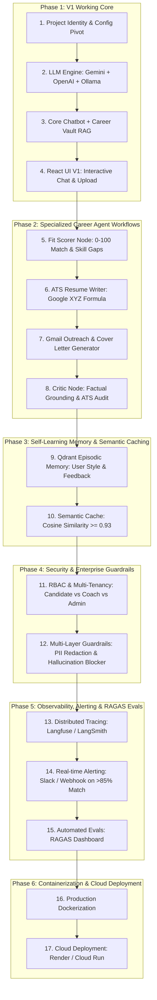

# CareerOps AI — Phased Implementation & Architecture Blueprint

An evolutionary, hands-on roadmap to pivot our base research agent into **CareerOps AI**, starting with a solid, working **V1 (Conversational Agent + Career Vault RAG + React UI + Multi-Model LLMs)** and methodically layering all advanced enterprise capabilities (**Specialized Nodes, Self-Learning Memory, Semantic Caching, RBAC, Guardrails, Observability & Cloud Deployment**).

---

## Architectural Framework Decision: LangGraph + Google Gemini / Model-Agnostic

### Why this combination gives the highest engineering and resume value:
1. **Orchestration Layer: LangGraph**
   - **Why:** LangGraph is the industry standard for stateful, cyclic multi-agent workflows. It provides explicit state management, deterministic conditional routing (`Command`), revision loops (Critic $\to$ Writer), and checkpointing (`Postgres` / `Memory`).
2. **Model & Inference Layer: Google Gemini / GenAI + OpenAI-Compatible Gateways**
   - **Why:** Gemini 2.0 Flash / Pro offers 1M+ token context windows (perfect for large candidate vaults + company blogs), fast structured outputs, and native tool-calling.
   - **Abstracted in `services/llm.py`:** Seamlessly switch via environment variables between Google Gemini, OpenAI, and local Ollama without rewriting agent logic.

---

## Master Phase-Wise Roadmap

---

## Phase Details & Actionable Steps

### Phase 1: V1 Working Core (Fast Interactive Foundation)
*Goal: Get a fully working, interactive conversational career assistant running locally with document ingestion, vector retrieval, and live UI.*
- **Step 1.1: Project Branding & Minimal Pivot**:
  - Update `pyproject.toml`, `services/config.py`, and domain metadata to `CareerOps AI`.
  - Ensure clean dependency management (FastAPI, LangGraph, Qdrant, Google GenAI / OpenAI, pypdf).
- **Step 1.2: Model-Agnostic LLM Engine**:
  - Update `services/llm.py` with multi-provider support: Google Gemini (`google-genai` / OpenAI-compatible endpoint), OpenAI, and Ollama.
- **Step 1.3: Conversational Chatbot + Career Vault RAG**:
  - Ingest Candidate Resumes/CVs into Qdrant `candidate_vault` collection.
  - Test LangGraph conversational pipeline with real document chunking & retrieval.
- **Step 1.4: React UI V1 Validation**:
  - Run frontend + backend locally, test resume upload, verify live markdown streaming, session management, and conversational Q&A.

---

### Phase 2: Specialized Career Agent Workflows
*Goal: Add agentic intelligence specifically tailored for job seekers and career switchers.*
- **Step 2.1: JD Decomposition & Match Fit Scorer (0–100)**:
  - Input: Pasted Job Description or PDF.
  - Output: Structured JSON with Hard Skills vs Soft Skills, Match Score (0–100), and missing critical requirements.
- **Step 2.2: ATS Resume Customizer (Google XYZ Formula)**:
  - Rewrites experience bullets tailored to the target JD using *"Accomplished [X] measured by [Y] by doing [Z]"*.
- **Step 2.3: Personalized Gmail Cold Outreach Generator**:
  - Researches company engineering background/news and generates a 1-click recruiter email.
- **Step 2.4: Factual Critic & ATS Audit Quality Gate**:
  - Audits generated bullets against the user's raw vault (prevents hallucinating fake skills) and re-loops if ATS keyword density is $<85\%$.

---

### Phase 3: Self-Learning Memory & Semantic Caching
*Goal: Optimize latency, cut LLM API costs by 60%, and enable continuous self-learning.*
- **Step 3.1: Self-Learning Episodic Memory (Qdrant)**:
  - Stores user feedback (*"Prefer bullet length under 2 lines"*, *"Emphasize distributed systems over frontend"*).
  - Retrieves style rules on subsequent runs to continuously adapt.
- **Step 3.2: Semantic Caching Layer**:
  - Vector similarity cache ($\ge 0.93$) in `services/cache.py` for frequent company profiles and skill taxonomy lookups.

---

### Phase 4: Security, RBAC & Multi-Layer Guardrails
*Goal: Enterprise compliance, candidate privacy, and prompt safety.*
- **Step 4.1: RBAC & Multi-Tenant Isolation**:
  - JWT auth in `api/deps.py` with roles: `JobSeeker` (isolated vault), `CareerCoach` (batch review), `Admin`.
- **Step 4.2: Guardrails Layer**:
  - **Input:** PII Anonymization (auto-redacts candidate phone numbers, addresses, personal identifiers before external LLM calls).
  - **Output:** Anti-Exaggeration Guardrail (verifies every resume claim has grounding in raw vault).

---

### Phase 5: Observability, Alerting & RAGAS Evals
*Goal: Production LLMOps visibility and automated quality benchmarking.*
- **Step 5.1: Distributed Tracing (Langfuse & LangSmith)**:
  - Capture token costs, latencies, tool calls, and prompt versions in `services/tracing.py`.
- **Step 5.2: Real-time Alerting**:
  - Webhook / Slack notifications on $>85\%$ job match score or Critic quality gate rejections.
- **Step 5.3: Automated Evals Dashboard**:
  - Real-time RAGAS scoring (Faithfulness, Answer Relevance, Context Precision).

---

### Phase 6: Cloud Deployment & Resume Showcase
*Goal: Deploy live to the web and document for portfolio/resume.*
- **Step 6.1: Containerization**:
  - Multi-stage `Dockerfile` and `docker-compose.prod.yml`.
- **Step 6.2: Cloud Deployment**:
  - Render deployment via `render.yaml` or GCP Cloud Run.
- **Step 6.3: Production Documentation**:
  - Comprehensive README with architecture diagrams, API docs, and impactful resume bullet points.
