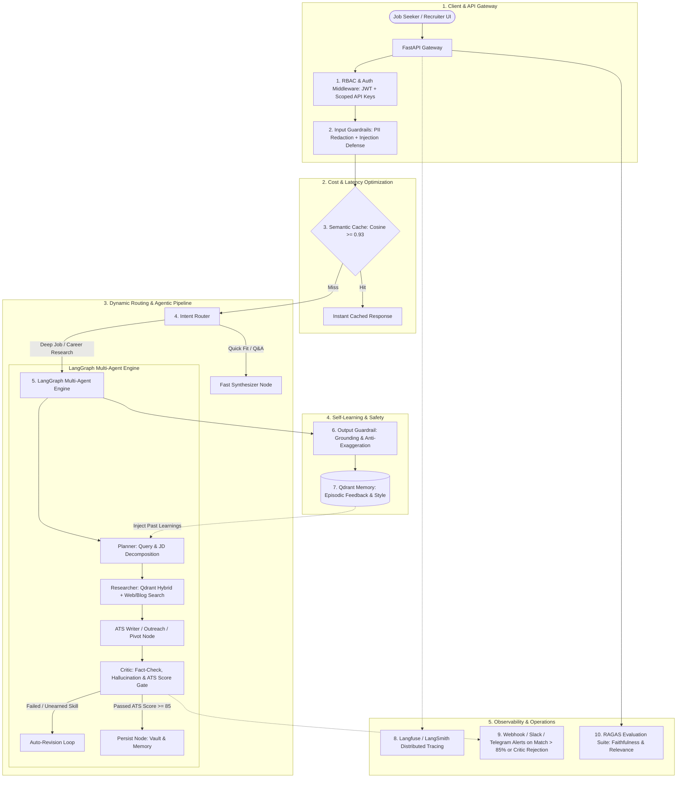

# 🚀 CareerOps AI — Autonomous Job Search & Career Due-Diligence Agent

> **Inspired by the Observable Job Agent, Multi-Agent LLMOps & Job Hunt Automation**

A production-grade, multi-agent AI career copilot and due-diligence platform that automates job search, job description analysis, fit scoring, high-ATS resume tailoring, cold Gmail outreach, and career pivot research with **LangGraph, Qdrant Hybrid RAG, Self-Learning Memory, Multi-layer Guardrails, RBAC, Semantic Caching, and Observability**.

---

## 🎯 Executive Problem & Solution

### The Problem:
Job seekers and career switchers spend hundreds of hours manually browsing job boards, reading company engineering blogs, assessing skill matches, identifying technical gaps, and customizing resumes, cover letters, and outreach emails for every application.

### What CareerOps AI Does:
1. **Career Vault Ingestion:** Candidate uploads their **Resume / CV (PDF/DOCX)**, raw project notes, GitHub repo links, and career domain preferences.
2. **Multi-Agent Research:** Searches real-time job listings & web company engineering blogs/news, decomposing requirements into hard technical vs soft skill sets.
3. **Gap & Fit Analysis:** Computes a precise **Match Score (0–100)**, details exact technical gaps, and outlines a clear action roadmap.
4. **High-ATS Tailored Generation:** Generates tailored, high-signal resumes (using the Google XYZ formula: *"Accomplished [X] measured by [Y] by doing [Z]"*) with strict grounding against the user's real experience.
5. **Cold Outreach & Gmail Application Drafts:** Generates 1-click tailored cold outreach emails to hiring managers/recruiters citing company-specific engineering challenges.
6. **Career Pivot & Strategy Research:** Identifies transferable skills, project ideas, and a step-by-step learning roadmap for career pivots (e.g. Backend Engineer → AI/ML Engineer).
7. **Self-Learning Episodic RAG:** Learns and remembers candidate tone, bullet length preferences, feedback, and past interview outcomes across sessions.

---

## 🧩 Complete Architecture & Enterprise Feature Matrix

### Feature Implementation Details:
* **RBAC:** Multi-tenant roles (`JobSeeker` for personal workspace isolation, `CareerCoach / Recruiter` for batch candidate reviews, `Admin`).
* **Multi-Layer Guardrails:**
  * **Input:** PII Anonymization (automatically redacts phone numbers, physical addresses, sensitive identity data before calling external LLMs) + Prompt Injection defense.
  * **Output:** Anti-Exaggeration & Hallucination Guardrail (validates that every resume claim has verifiable grounding in the user's career vault).
* **Semantic Caching:** Cache parsed company profiles, common job descriptions, and skill taxonomies to reduce LLM API latency and cut costs by ~60%.
* **Intent Router:** Automatically routes incoming requests into:
  1. `Quick Fit Check & Match Score (0–100)`
  2. `Deep Company & Job Due-Diligence`
  3. `High-ATS Resume Customizer`
  4. `Personalized Gmail / Cold Outreach Generator`
  5. `Career Pivot & Transferable Skills Matrix`
  6. `Interview Prep & Technical Battlecard`
* **Observability (Langfuse / LangSmith):** Full distributed tracing capturing token costs, step latencies, prompt versioning, and tool calls for every candidate execution.
* **Alerting:** Webhook / Telegram / Slack notifications triggered when a job post match score is $>85\%$ or when the Critic flags persistent ungrounded claims.
* **Automated Evals (RAGAS):** Rigorous evaluation harness for context precision, context recall, faithfulness, and ATS keyword match percentage.

---

## 🗺️ Step-by-Step Educational Implementation Roadmap

We will build the entire system progressively so you can learn each layer hands-on:

### [ ] Phase 1: Domain Schemas, Multi-Tenancy & RBAC Security Layer
- Implement user roles (`JobSeeker`, `CareerCoach`, `Admin`) and permission scopes.
- Add JWT authentication and scoped API key verification in `api/deps.py` and `services/auth.py`.
- Secure candidate career vaults with workspace-level multi-tenant isolation.

### [ ] Phase 2: Semantic Caching Layer (Fast Retrieval & Cost Reduction)
- Implement `services/cache.py` using vector similarity search (Cosine similarity $\ge 0.93$).
- Cache parsed company profiles, recurring job requirements, and skill taxonomies.
- Add cache hit/miss headers and telemetry metrics.

### [ ] Phase 3: Multi-Layer Guardrails (PII Anonymization & Anti-Exaggeration)
- Implement `services/guardrails.py`:
  - **Input Guardrail:** Regex + entity-based PII masking (names, phone numbers, emails, addresses).
  - **Output Guardrail:** Grounding auditor ensuring no fabricated tech skills or unearned achievements pass through.

### [ ] Phase 4: Intent Router & Expanded Multi-Agent Nodes
- Enhance `graph/` with specialized state and nodes:
  - **Planner Node:** Extracts hard/soft skills from JD and decomposes research sub-queries.
  - **Fit Scorer Node:** Computes Match Score (0–100) and highlights missing skill gaps.
  - **ATS Resume Writer Node:** Rewrites experience bullets with the Google XYZ formula.
  - **Gmail Outreach Writer Node:** Crafts personalized hiring manager email drafts.
  - **Career Pivot Node:** Generates 6-month roadmap and transferable skill matrix.
  - **Critic & Fact-Check Node:** Enforces ATS keyword density and grounding rules with an automated revision loop.
  - **Self-Learning Episodic Memory Node:** Stores and retrieves user feedback, stylistic guidelines, and past interview notes in Qdrant `memory`.

### [ ] Phase 5: Observability (Langfuse / LangSmith) & Real-time Alerting
- Implement `services/tracing.py` for seamless dual-support of **Langfuse** and **LangSmith**.
- Implement `services/alerting.py` for Slack / Discord / Webhook notifications on high match score ($>85\%$) or Critic quality gate rejections.

### [ ] Phase 6: Modern Web UI & Live Dashboard
- Update React frontend with:
  - Role switcher & authentication modal.
  - Interactive JD Upload & Match Score gauge (0–100).
  - High-ATS Resume comparison & 1-click Markdown/PDF copy.
  - Gmail Outreach draft preview with 1-click copy.
  - Live agent reasoning step markers, cache badges, and real-time RAGAS evaluation dashboard.

### [ ] Phase 7: Containerization & Cloud Deployment
- Create production multi-stage Dockerfiles (`Dockerfile.backend`, `Dockerfile.frontend`).
- Configure cloud deployment recipes (`render.yaml` for Render, Docker for Cloud Run / Railway).
- Write production README with architectural diagrams, benchmark evaluation results, and bullet points for your resume.

---

## 🧪 Verification Plan

1. **Automated Unit & Security Tests:**
   - RBAC test: Verify `JobSeeker` cannot access other candidates' vaults.
   - Guardrails test: Anonymize sample resume containing PII; verify redacted output.
   - Cache test: Query identical company info twice; verify second call hits semantic cache in $<50\text{ms}$.
2. **End-to-End Agentic Execution:**
   - Ingest candidate profile + target Senior AI Engineer JD.
   - Verify Match Score (0–100) computation, ATS resume generation, and Gmail outreach draft.
   - Test Self-Learning memory by injecting user feedback and verifying updated style in subsequent runs.
3. **Observability & Alerting Test:**
   - Verify trace generation in Langfuse/LangSmith dashboard.
   - Trigger a simulated $>85\%$ match score and verify webhook alert delivery.
4. **Cloud Deployment Verification:**
   - Spin up full stack locally and on cloud staging (Render / Cloud Run) to verify API, DB, Qdrant, and React UI.
