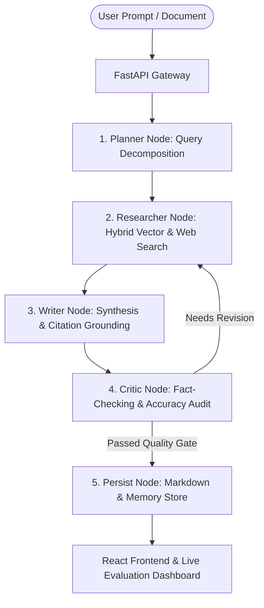

# 🔍 Autonomous Deep Research Assistant

[](https://fastapi.tiangolo.com)
[](https://github.com/langchain-ai/langgraph)
[](ui/)
[](docker-compose.yml)
[](docker-compose.yml)
[](LICENSE)

A production-grade, multi-agent autonomous research assistant: **Planner → Research → Writer → Critic → Persist**, built with **LangGraph**, **FastAPI**, **Qdrant vector search**, **PostgreSQL**, and a modern **React + Vite** web interface with integrated evaluation dashboards.

---

## 🏗️ Architecture & Pipeline Flow



---

## 🌟 Key Features

* **Multi-Agent State Graph:** Stateful execution flow with explicit planning, multi-source retrieval, draft writing, and factual critic feedback loops.
* **Hybrid Search & Vector Store:** Multi-tenant workspace document ingestion powered by **Qdrant** and hybrid vector/keyword retrieval.
* **Integrated Evaluation Suite:** Real-time agent evaluation framework supporting **RAGAS metrics** (faithfulness, answer relevance, context recall) and custom evaluation test suites.
* **Modern Web Interface:** Full-featured **React + TypeScript + Vite** frontend with dynamic streaming markers, markdown rendering, and interactive eval dashboards.
* **Model Agnostic:** Seamlessly switch between **OpenAI-compatible endpoints**, **Google GenAI / ADK**, and **Local Ollama** models.

---

## 📂 Project Structure

```
├── api/                  # FastAPI endpoints (chat, documents, evals, memory, workspaces)
│   ├── routes/           # Modular route controllers
│   ├── deps.py           # Dependency injection & security
│   └── main.py           # Application entrypoint
├── domain/               # Pydantic schemas, domain models & LangGraph state definitions
├── graph/                # LangGraph core workflow (builder, nodes, runner, pipeline markers)
├── services/             # Core business logic
│   ├── llm.py            # Multi-provider LLM client wrappers
│   ├── vectorstore.py    # Qdrant client & hybrid search
│   ├── ingest.py         # Document parsing & chunking pipeline
│   ├── ragas_eval.py     # Ragas evaluation harness
│   └── agentic_eval.py   # Agent reasoning evaluation metrics
├── ui/                   # React 18 + Vite frontend
│   ├── src/components/   # Chat, FormattedAnswer, ResearchMarkers, EvalDashboard
│   └── src/context/      # Workspace & session state management
├── scripts/              # Ingestion utilities, fixture loaders, and E2E evaluation runners
└── docker-compose.yml    # Infrastructure orchestration (Qdrant, Postgres)
```

---

## 🚀 Quick Start

### 1. Start Infrastructure
```bash
docker-compose up -d    # Starts Qdrant and PostgreSQL
```

### 2. Configure Environment
Create `.env` based on `.env.example`:
```env
LLM_PROVIDER=openai
EMBEDDING_PROVIDER=openai
OPENAI_API_KEY=your-api-key
OPENAI_BASE_URL=https://api.openai.com/v1
OPENAI_MODEL=gpt-4o
OPENAI_EMBEDDING_MODEL=text-embedding-3-small
EMBEDDING_DIM=1536
```

### 3. Run Backend API
```bash
pip install -e .
uvicorn api.main:app --reload --port 8000
```

### 4. Run Frontend UI
```bash
cd ui
npm install
npm run dev
```

---

## 📊 API Workflow Overview

1. **Create Workspace:** `POST /api/v1/workspaces` (returns `api_key` & `workspace_id`)
2. **Ingest Documents:** `POST /api/v1/workspaces/{id}/documents` (Upload PDF / MD / TXT)
3. **Initialize Session:** `POST /api/v1/workspaces/{id}/sessions`
4. **Execute Research:** `POST /api/v1/workspaces/{id}/sessions/{session_id}/chat`
5. **Inspect Evals:** `GET /api/v1/evals/dashboard`

---

## 🧪 Testing & Evals

Run the built-in evaluation suite:
```bash
python scripts/eval_all_test.py
python scripts/e2e_agent_test.py
```
