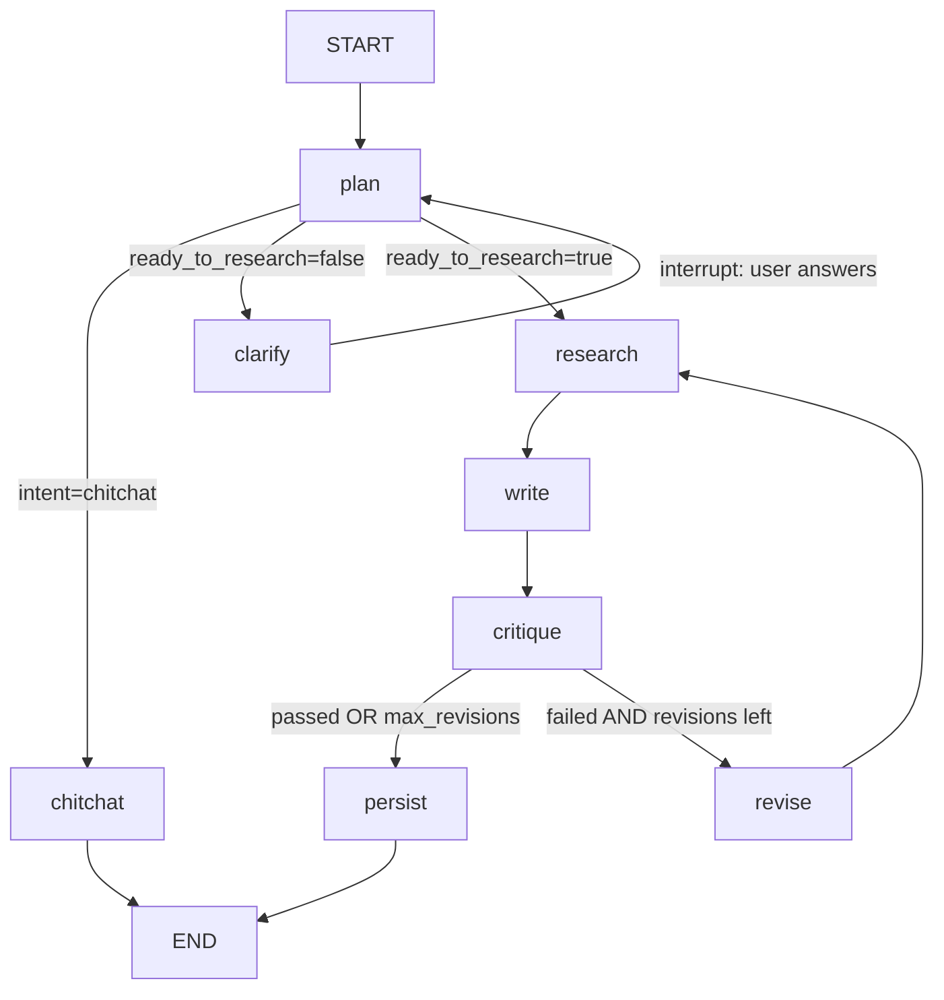
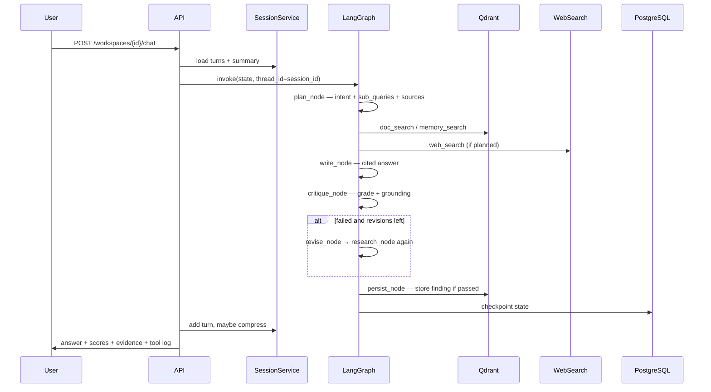
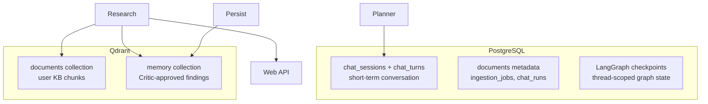
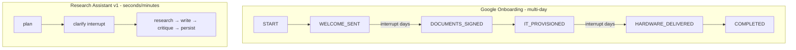

# Research Assistant — LangGraph Design (before any code)

This plan follows the **5-step LangGraph framework** from [`1.ThinkinginLangGraph.md`](projects/priority-one/project-a-ai-rca/a-domain-a-app/c-development/resources/agents_handson/langgraph/docs/1.ThinkinginLangGraph.md). No implementation until you approve this design.

---

## Step 1 — Map workflow as discrete nodes

Each box in your diagram becomes one LangGraph **node**. Routing decisions live inside nodes (via `Command`) or conditional edges.



### Node inventory

| Node | Step type | What it does | External calls |
|---|---|---|---|
| `plan` | **LLM** | Classify intent, check if query has enough detail to research, emit sub-queries + sources | LLM only |
| `clarify` | **User input** | Pause via `interrupt()`, ask 1-2 targeted questions, merge answer back into query | None (waits for user) |
| `chitchat` | **LLM** | Greetings/meta — skip retrieval entirely | LLM only |
| `research` | **LLM + Data** | Run tools per plan; synthesize bullet notes from evidence only | Qdrant, web API |
| `write` | **LLM** | Draft cited answer from notes + session context | LLM only |
| `critique` | **LLM** | Score correctness/completeness/clarity + grounding check | LLM only |
| `revise` | **Action** | Increment revision counter; attach critic's gap note | None |
| `persist` | **Action** | Write Critic-approved finding to Qdrant memory collection | Qdrant |

### Why this granularity (LangGraph trade-off)

- **`research` isolated from `write`**: retrieval failures get `RetryPolicy` without re-running the Writer. You can inspect notes before prose is generated.
- **`critique` separate from `write`**: grading logic stays auditable; revision loop is explicit.
- **`persist` is its own node**: memory writes are checkpointed; a Qdrant failure doesn't re-run the whole graph.
- **`clarify` before research**: Planner checks sufficiency first — don't burn retrieval on "tell me about security" when you don't know which topic.
- **`chitchat` bypass**: "hi" must not trigger a 4-agent pipeline (reference pattern).

### Intent routing + sufficiency gate

Before research starts, the **Planner** answers two questions:
1. Is this a research request at all? (or chitchat?)
2. Does the query have **enough detail** to produce useful search queries?

| Planner output | Example user message | Graph path |
|---|---|---|
| `intent=chitchat` | "hi", "who are you?" | plan → chitchat → END |
| `ready_to_research=false` | "Tell me about security", "Compare them" (no prior context) | plan → clarify → **pause** → user answers → plan again |
| `ready_to_research=true` | "What's our API key rotation process?", "Compare DPR vs hybrid RAG papers" | plan → research → write → critique → … |

| Research `intent` (when ready) | Example |
|---|---|
| `single_doc` | "What does section 3 of the security policy say?" |
| `comparison` | "Compare paper A vs paper B on retrieval" |
| `synthesis` | "Summarize key rotation across all docs" |
| `followup` | "Expand on the revoke step" — uses session memory + `use_memory: true` |

**`clarify` is NOT `chitchat`.** Chitchat skips the pipeline entirely. Clarify pauses mid-pipeline because the query is a real research request but **underspecified** — the Planner can't write good sub-queries yet.

**Sufficiency rules (Planner prompt):**
- Vague scope ("security", "the papers", "that process") → `ready_to_research=false`, ask which doc/topic/aspect
- Missing referent ("compare them", "what about that?") with no session context → clarify
- `followup` with prior turns in session → usually `ready_to_research=true` (context exists)
- Specific question with clear search terms → `ready_to_research=true`

**`clarify` node (LangGraph `interrupt()`):**
```python
def clarify_node(state) -> Command[Literal["plan"]]:
    questions = state["plan"]["clarifying_questions"]  # 1-2 max
    user_reply = interrupt({"questions": questions, "original_query": state["query"]})
    # Merge user's clarification into the query, re-plan with richer context
    enriched = f"{state['query']}\n\nUser clarification: {user_reply['answer']}"
    return Command(update={"query": enriched}, goto="plan")
```

Cap clarifications at **2 rounds** (`clarify_count` in state) — after that, proceed with best-effort research rather than looping forever.

---

## Step 2 — Identify what each node needs

### LLM nodes

| Node | Static context (prompt) | Dynamic context (from state) | Output |
|---|---|---|---|
| `plan` | Intent categories, sufficiency rules, source routing, JSON schema | `query`, `conversation_turns`, `conversation_summary`, `clarify_count` | `Plan` dict |
| `clarify` | Ask 1-2 specific questions, not open-ended | `plan.clarifying_questions`, `query` | enriched `query` via interrupt |
| `research` | "Only state what evidence supports" | `plan.sub_queries`, `plan.sources`, `revision_note` | `notes` str, `evidence` list |
| `write` | Citation format, tone, no parametric knowledge | `notes`, `conversation_*`, `revision_note` | `answer` str |
| `critique` | Rubric 1-5, grounding rules for doc/web/memory | `query`, `answer`, `evidence` | `Critique` dict |
| `chitchat` | Assistant persona | `query`, `conversation_*` | `answer` str |

### Data nodes (inside `research` via tools)

| Tool | Parameters | Retry | Notes |
|---|---|---|---|
| `doc_search` | query, workspace_id, top_k | Yes (3x, backoff) | Qdrant `documents` collection, filter by workspace |
| `get_section` | doc_id, section, workspace_id | Yes | Payload scroll + filter, not vector search |
| `memory_search` | query, workspace_id, top_k | Yes | Qdrant `memory` collection |
| `web_search` | query, top_k | Yes | DuckDuckGo (free) or Tavily (prod) |

### Action nodes

| Node | When | Failure handling |
|---|---|---|
| `revise` | Critic fails, revisions < MAX | Always succeeds (pure state update) |
| `persist` | Critic passes (or max revisions exhausted) | Log error, don't fail the run — memory is nice-to-have |

### Error strategy (from LangGraph doc)

| Failure | Strategy |
|---|---|
| Qdrant/web timeout | `RetryPolicy` on `research` node |
| LLM JSON parse fail | Fallback plan in `plan` node; store error in state |
| Qdrant write fail in `persist` | Catch, log, continue to END |
| Unexpected | Bubble up for debugging |

---

## Step 3 — Design state (raw data only)

**Principle:** state stores raw data. Prompts are formatted inside nodes on-demand.

Also separate **three storage layers** (common confusion):

| Layer | Technology | Purpose |
|---|---|---|
| Graph checkpoint | Postgres (`langgraph-checkpoint-postgres`) | Thread-scoped execution state, resume/debug, one checkpoint per super-step |
| Session conversation | Postgres `chat_sessions` table OR derived from checkpoints | Last N turns + compressed summary for Planner/Writer |
| Semantic memory | Qdrant `memory` collection | Cross-session findings (Critic-approved) |
| Document chunks | Qdrant `documents` collection | User-uploaded KB |

```python
# domain/state.py — LangGraph TypedDict (raw data only)

class ResearchGraphState(TypedDict, total=False):
    # --- inputs (set at invoke) ---
    query: str
    workspace_id: str
    session_id: str          # maps to LangGraph thread_id
    conversation_turns: list[dict]   # [{query, answer, score}] — last 4 verbatim
    conversation_summary: str        # compressed older turns

    # --- planner output ---
    plan: dict               # Plan model as dict

    # --- research output ---
    evidence: list[dict]     # Evidence model as dict — NOT formatted text
    notes: str               # Research agent's synthesis (still raw agent output)
    tool_calls: list[dict]   # audit log: {tool, query, hit_count, duration_ms}

    # --- writer output ---
    answer: str

    # --- critic output ---
    critique: dict           # Critique model as dict

    # --- loop control ---
    revision_note: str
    revisions: int
    clarify_count: int               # cap at 2 clarify rounds before forcing research

    # --- runtime deps (injected, not checkpointed ideally) ---
    _deps: dict              # llm, toolkit, logger — pass via config not state in prod
```

**Do NOT store in state:** formatted evidence blocks, prompt templates, embedder handles, DB clients.

---

## Step 4 — Basic classes (domain models + services)

Keep **agent logic as plain functions** (testable, matches reference). Use **Pydantic/dataclasses** for structured data and **service classes** for I/O.

### Domain models (`domain/models.py`)

```python
class Plan(BaseModel):
    intent: Literal["single_doc", "comparison", "synthesis", "followup", "chitchat"]
    ready_to_research: bool         # False → route to clarify node
    clarifying_questions: list[str] # 1-2 questions when ready_to_research=False
    sub_queries: list[str]          # 1-4 items (empty if not ready)
    sources: list[Literal["docs", "web", "memory"]]
    use_memory: bool
    reasoning: str

class Evidence(BaseModel):
    text: str
    origin: Literal["documents", "memory", "web"]
    doc_id: str | None
    doc_title: str
    section: str | None
    url: str | None                 # web only
    score: float
    chunk_index: int | None

class Critique(BaseModel):
    correctness: int                # 1-5
    completeness: int
    clarity: int
    average: float
    grounded: bool
    passed: bool
    revision_request: str | None
    comments: str

class Turn(BaseModel):
    query: str
    answer: str
    score: float

class DocumentMeta(BaseModel):      # lives in Postgres
    id: str
    workspace_id: str
    title: str
    source_type: str                # pdf | md | txt | srt
    chunk_count: int
    status: Literal["pending", "indexed", "failed"]
    created_at: datetime
```

### Service classes (thin, one responsibility)

| Class | File | Responsibility |
|---|---|---|
| `SessionService` | `services/session.py` | Load/save turns, compress summary between questions |
| `IngestService` | `services/ingest.py` | Parse file → chunks → embed → Qdrant upsert + Postgres metadata |
| `VectorStore` | `services/vectorstore.py` | Qdrant read/write for documents + memory collections |
| `ResearchToolkit` | `services/tools.py` | doc_search, get_section, memory_search, web_search → list[Evidence] |
| `ResearchGraphRunner` | `graph/runner.py` | compile graph, invoke with thread_id, return final state |
| `RunLogger` | `services/observability.py` | Append tool/agent events to Postgres `chat_runs` |

### Agent functions (`graph/nodes.py`) — NOT classes

```python
def plan_node(state: ResearchGraphState) -> Command[Literal["chitchat", "clarify", "research"]]: ...
def clarify_node(state: ResearchGraphState) -> Command[Literal["plan"]]: ...
def research_node(state: ResearchGraphState) -> dict: ...
def write_node(state: ResearchGraphState) -> dict: ...
def critique_node(state: ResearchGraphState) -> dict: ...
def revise_node(state: ResearchGraphState) -> dict: ...
def persist_node(state: ResearchGraphState) -> dict: ...
def chitchat_node(state: ResearchGraphState) -> dict: ...
```

---

## Step 5 — Wire the graph

```python
# graph/builder.py
workflow = StateGraph(ResearchGraphState)
workflow.add_node("plan", plan_node)
workflow.add_node("chitchat", chitchat_node)
workflow.add_node("research", research_node,
                  retry_policy=RetryPolicy(max_attempts=3))
workflow.add_node("write", write_node)
workflow.add_node("critique", critique_node)
workflow.add_node("revise", revise_node)
workflow.add_node("persist", persist_node)

workflow.add_edge(START, "plan")
# plan routes via Command(goto=...)
workflow.add_edge("research", "write")
workflow.add_edge("write", "critique")
workflow.add_edge("revise", "research")
workflow.add_edge("persist", END)
workflow.add_edge("chitchat", END)

checkpointer = PostgresSaver(conn_string)   # prod
graph = workflow.compile(checkpointer=checkpointer)
```

**thread_id = session_id** — one conversation thread per chat session. LangGraph checkpoint handles within-run persistence; Postgres `chat_sessions` holds the compressed conversation summary for cross-invoke context.

---

## End-to-end flow (one question)



---

## Vector DB choice: **Qdrant**

| Option | Verdict | Why |
|---|---|---|
| **Qdrant** | **Recommended** | Native payload filtering (`workspace_id`), two collections, Docker-native, scales independently from Postgres, good Python client |
| pgvector (same Postgres) | Alternative for minimal ops | One DB to manage; fine for learning v1; harder to scale vector search separately |
| Actian VectorAI | Reference only | Works in demo repo; less common, harder for general users to deploy |
| Chroma | Skip | Good for prototypes; weaker multi-tenant filtering story |

### Qdrant collections

**Collection 1: `documents`** — chunked user uploads

```json
{
  "id": "uuid",
  "vector": [384-dim],
  "payload": {
    "workspace_id": "ws_abc",
    "doc_id": "doc_xyz",
    "doc_title": "Security Policy",
    "source_type": "pdf",
    "section": "API Key Rotation",
    "chunk_index": 3,
    "text": "..."
  }
}
```

**Collection 2: `memory`** — Critic-approved findings

```json
{
  "id": "uuid",
  "vector": [384-dim],
  "payload": {
    "workspace_id": "ws_abc",
    "kind": "finding",
    "query": "API key rotation process?",
    "finding": "...",
    "session_id": "sess_123",
    "critic_score": 4.2,
    "doc_ids": ["doc_xyz"],
    "source_mix": "docs",
    "created_at": "2026-08-02T12:00:00"
  }
}
```

Every search filters: `workspace_id == <current workspace>`.

Embeddings: `BAAI/bge-small-en-v1.5` (384-dim, local, free).

---

## Main DB: PostgreSQL schema

Postgres holds **metadata, sessions, audit logs** — not vectors.

```sql
-- workspaces: one per user/team KB
CREATE TABLE workspaces (
    id          UUID PRIMARY KEY DEFAULT gen_random_uuid(),
    name        TEXT NOT NULL,
    api_key     TEXT UNIQUE NOT NULL,       -- simple auth for v1
    created_at  TIMESTAMPTZ DEFAULT now()
);

-- documents: metadata only; chunks live in Qdrant
CREATE TABLE documents (
    id            UUID PRIMARY KEY DEFAULT gen_random_uuid(),
    workspace_id  UUID NOT NULL REFERENCES workspaces(id) ON DELETE CASCADE,
    title         TEXT NOT NULL,
    filename      TEXT NOT NULL,
    source_type   TEXT NOT NULL,            -- pdf | md | txt | srt
    chunk_count   INT DEFAULT 0,
    status        TEXT DEFAULT 'pending',   -- pending | indexed | failed
    error_message TEXT,
    created_at    TIMESTAMPTZ DEFAULT now()
);
CREATE INDEX idx_documents_workspace ON documents(workspace_id);

-- chat_sessions: maps to LangGraph thread_id
CREATE TABLE chat_sessions (
    id            UUID PRIMARY KEY DEFAULT gen_random_uuid(),
    workspace_id  UUID NOT NULL REFERENCES workspaces(id) ON DELETE CASCADE,
    summary       TEXT DEFAULT '',          -- compressed older turns
    created_at    TIMESTAMPTZ DEFAULT now(),
    updated_at    TIMESTAMPTZ DEFAULT now()
);
CREATE INDEX idx_sessions_workspace ON chat_sessions(workspace_id);

-- chat_turns: short-term conversation memory
CREATE TABLE chat_turns (
    id            UUID PRIMARY KEY DEFAULT gen_random_uuid(),
    session_id    UUID NOT NULL REFERENCES chat_sessions(id) ON DELETE CASCADE,
    query         TEXT NOT NULL,
    answer        TEXT NOT NULL,
    critic_score  FLOAT,
    created_at    TIMESTAMPTZ DEFAULT now()
);
CREATE INDEX idx_turns_session ON chat_turns(session_id);

-- chat_runs: observability — one row per graph invocation
CREATE TABLE chat_runs (
    id            UUID PRIMARY KEY DEFAULT gen_random_uuid(),
    session_id    UUID NOT NULL REFERENCES chat_sessions(id),
    workspace_id  UUID NOT NULL REFERENCES workspaces(id),
    query         TEXT NOT NULL,
    plan          JSONB,
    critique      JSONB,
    revisions     INT DEFAULT 0,
    evidence      JSONB,                    -- list of Evidence dicts
    tool_calls    JSONB,
    duration_ms   INT,
    created_at    TIMESTAMPTZ DEFAULT now()
);

-- ingestion_jobs: async upload tracking (optional v1, useful for large PDFs)
CREATE TABLE ingestion_jobs (
    id            UUID PRIMARY KEY DEFAULT gen_random_uuid(),
    document_id   UUID NOT NULL REFERENCES documents(id),
    status        TEXT DEFAULT 'queued',    -- queued | running | done | failed
    error_message TEXT,
    created_at    TIMESTAMPTZ DEFAULT now()
);
```

LangGraph checkpoints live in **separate tables** managed by `langgraph-checkpoint-postgres` — do not hand-roll those.

---

## REST API (minimal v1)

Base: `/api/v1` — auth via `X-API-Key` header (maps to workspace).

| Method | Endpoint | Purpose |
|---|---|---|
| `POST` | `/workspaces` | Create workspace, returns `id` + `api_key` |
| `GET` | `/workspaces/{id}` | Workspace info + doc/memory counts |
| `POST` | `/workspaces/{id}/documents` | Upload file (multipart) → ingest → Qdrant |
| `GET` | `/workspaces/{id}/documents` | List indexed documents |
| `DELETE` | `/workspaces/{id}/documents/{doc_id}` | Remove doc metadata + Qdrant chunks |
| `POST` | `/workspaces/{id}/sessions` | Create chat session → returns `session_id` |
| `POST` | `/workspaces/{id}/sessions/{session_id}/chat` | **Main endpoint** — runs LangGraph, returns answer OR `{status: "needs_clarification", questions: [...]}` |
| `POST` | `/workspaces/{id}/sessions/{session_id}/chat/resume` | Resume after clarify interrupt — pass `{answer: "..."}` |
| `GET` | `/workspaces/{id}/sessions/{session_id}/history` | List turns |
| `GET` | `/workspaces/{id}/memory/search?q=...` | Semantic search over long-term memory |
| `DELETE` | `/workspaces/{id}/memory` | Reset memory collection for workspace |
| `GET` | `/health` | Postgres + Qdrant + LLM reachable |

### Chat response shape

```json
{
  "answer": "...",
  "critique": {"correctness": 4, "completeness": 4, "clarity": 5, "passed": true, "grounded": true},
  "evidence": [{"origin": "documents", "doc_title": "...", "section": "...", "score": 0.82}],
  "plan": {"intent": "synthesis", "sources": ["docs", "memory"], "sub_queries": ["..."]},
  "revisions": 0,
  "run_id": "uuid"
}
```

---

## Minimal folder structure

```
b-research-agent/
├── docker-compose.yml              # postgres + qdrant (+ optional ollama)
├── pyproject.toml
├── .env.example
│
├── api/
│   ├── main.py                     # FastAPI app factory
│   ├── deps.py                     # auth, db session, graph runner injection
│   └── routes/
│       ├── workspaces.py
│       ├── documents.py
│       ├── chat.py
│       └── memory.py
│
├── domain/
│   ├── models.py                   # Plan, Evidence, Critique, Turn, DocumentMeta
│   └── state.py                    # ResearchGraphState TypedDict
│
├── graph/
│   ├── nodes.py                    # plan, research, write, critique, revise, persist, chitchat
│   ├── builder.py                  # StateGraph compile + checkpointer
│   └── runner.py                   # ResearchGraphRunner
│
├── services/
│   ├── session.py                  # SessionService — turns + compression
│   ├── ingest.py                   # IngestService — parse/chunk/embed
│   ├── vectorstore.py              # VectorStore — Qdrant client
│   ├── tools.py                    # ResearchToolkit
│   ├── llm.py                      # LLM wrapper (Ollama / OpenAI via env)
│   ├── embedder.py                 # BGE embeddings
│   └── observability.py            # RunLogger
│
├── db/
│   ├── models.py                   # SQLAlchemy ORM tables
│   ├── session.py                  # engine + session factory
│   └── migrations/                 # Alembic
│
└── scripts/
    └── ingest_docs.py              # CLI bulk ingest (dev/testing)
```

**Deferred folders** (add when needed, not v1): `ui/` (Streamlit), `tests/`, `workers/` (async ingest queue).

---

## Three-memory model (summary)



| Memory | Where | Lifetime | Who writes | Who reads |
|---|---|---|---|---|
| Conversation turns | Postgres | Per session | API after each chat | Planner, Writer |
| Graph checkpoint | Postgres | Per thread/run | LangGraph auto | Resume/debug |
| Document chunks | Qdrant | Until deleted | IngestService | Research via doc_search |
| Long-term findings | Qdrant | Until memory reset | persist_node (Critic pass only) | Research via memory_search |

---

## Long-running pattern (Google ADK → LangGraph)

Reference: [`a-google-long-running-agent`](learning/c-projects/i-agenti-projects-all/a-google-long-running-agent/) — onboarding agent that pauses for **days** waiting for signatures/delivery webhooks, then resumes without re-running completed steps.

**Yes — LangGraph supports this natively.** Each Google pattern maps to a specific LangGraph feature:

| Google ADK pattern | LangGraph equivalent | How |
|---|---|---|
| **Durable memory schema** (enum state machine in SQLite, not raw chat in vector DB) | `ResearchGraphState` + `workflow_step` enum in Postgres checkpointer | Store structured fields (`current_step`, `pending_signals`) in state — not conversation JSON blobs |
| **Event-driven dormancy gates** (scale to zero, wake on webhook) | `interrupt()` + `PostgresSaver` + webhook resume API | Graph pauses, process exits, days later webhook calls `graph.invoke(Command(resume=...), config)` with same `thread_id` |
| **Multi-agent delegation** (HR coordinator → IT subagent) | Subgraphs or dedicated nodes | `it_provision` subgraph invoked from coordinator node; each subgraph can have its own checkpointer namespace |
| **Resume handler** (`OnboardingResumeHandler`) | FastAPI webhook route + `Command(resume=...)` | Same as our planned `POST .../chat/resume`, but triggered by external events not just user chat |
| **Side-effect safety on resume** | `@task` decorator (durable execution) | Wrap `doc_search`, email sends, ingest calls so resume doesn't re-execute expensive/side-effect ops |

### Google onboarding vs our research assistant



| Pause type | Duration | Already in plan? | LangGraph mechanism |
|---|---|---|---|
| **Clarify** — "which topic?" | Seconds–minutes | Yes (`clarify` node) | `interrupt()` |
| **Chat turn** — user asks follow-up | Minutes–hours | Yes (new invoke, same `thread_id`) | Checkpointer + session turns |
| **Dormancy gate** — wait for doc upload / human approval | Hours–days | Optional v2 | `interrupt()` + webhook resume |
| **Long-running workflow** — multi-step research project | Days–weeks | Optional v2 | State machine enum + multiple dormancy gates |

### v1 vs v2 scope

**v1 (current plan)** — already uses the *light* long-running features:
- `PostgresSaver` — survive crashes mid-research
- `clarify` + `interrupt()` — pause until user clarifies (minutes)
- Same `thread_id` across turns — conversation persists

**v2 (optional extension)** — full Google-style dormancy:
- Add `workflow_step` enum to state (e.g. `AWAITING_DOCS`, `RESEARCHING`, `AWAITING_APPROVAL`, `COMPLETED`)
- Add `dormancy_gate` node with `interrupt({"reason": "waiting_for_upload", "case_id": ...})`
- Webhook: `POST /workspaces/{id}/cases/{case_id}/resume` when user uploads docs or manager approves
- Wrap tool calls in `@task` so a resume after 3 days doesn't re-search Qdrant or re-send emails

Example dormancy use case for research assistant:
```
User: "Research our compliance posture — I'll upload the audit PDF tomorrow"
  → plan → dormancy_gate (interrupt: awaiting_document)
  → [process exits, zero compute for 2 days]
webhook: document uploaded
  → graph.invoke(Command(resume={"doc_id": "..."}), thread_id=session_id)
  → research → write → critique → persist
```

**Recommendation:** Build v1 first (clarify interrupt + PostgresSaver). The Google dormancy pattern is the same mechanism (`interrupt` + webhook resume) — add `workflow_step` enum and webhook routes in v2 when you want multi-day workflows.

---

## Build order (after design approval)

1. Docker Compose: Postgres + Qdrant
2. DB migrations + domain models
3. VectorStore + IngestService (upload works, search works — no agents)
4. ResearchToolkit (all 4 tools)
5. Graph nodes one at a time: plan → research → write → critique → loop → persist
6. FastAPI chat endpoint
7. web_search + mixed-evidence Critic rules
8. Deploy

Reference implementation (design spec only): [`research_assistant_with_memory/`](learning/c-projects/i-agenti-projects-all/all-agents-ref-repo/Hands-On-AI-Engineering-main/ai_agents/research_assistant_with_memory/)
